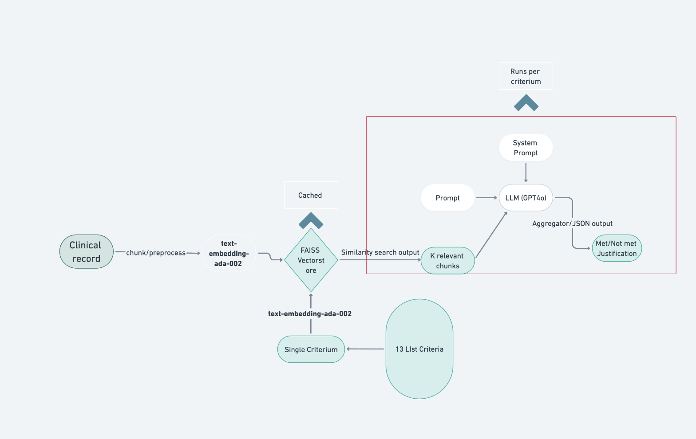

# Trial-to-Patient Matching


Reference repo from the publication: Investigating RAG-based Approaches in Clinical Trial and Patient Matching (ML4H, 2025)



Minimal instructions to reproduce the results linked from the paper.

## Methods
- Standard RAG: similarity search over embedded clinical note chunks.
- Temporal RAG: date-aware chunking/filtering for time-bound criteria (e.g., MI-6MOS).

## Datasets
- n2c2 (2018 Cohort Selection Challenge). The dataset is not publicly downloadable; request access and place XML files under:
  - `2018n2c2/<patient_id>.xml`

## Setup
1) Create environment and install deps
```bash
python -m venv .venv
source .venv/bin/activate
pip install langchain-openai langchain langchain-community langchain-core numpy python-dateutil faiss-cpu python-dotenv
```
2) Configure API key
```bash
export OPENAI_API_KEY=your_key_here
```
3) Prepare data
- Put the n2c2 XML files in `2018n2c2/` (not versioned).

## How to Run
Use `main.py` as a library (example below). This evaluates one patient against the 13 default criteria and returns metrics and details.
```python
from main import load_eligibility_criteria, process_patient

criteria = load_eligibility_criteria()
result = process_patient(
    patient_id=100,           # e.g., 100.xml must exist under 2018n2c2/
    criteria_list=criteria,
    chunk_size=500,
    chunk_overlap=50,
    k_value=3,
    use_mmr=False,            # set True to enable diversity retrieval
    lambda_mult=0.3,          # only used if use_mmr=True
    date_aware=True,          # set False for standard RAG
    verbose_dir=None,         # set a path to log prompts/responses
)
print(result["metrics"])
```

Batch runs: loop over patient IDs; set `force_refresh_vectorstore=True` if you change chunking params.

## Results
Aggregated per-criterion metrics (as reported in the paper) are stored here:
- `results/pre/pre_modificiations.json`
- `results/post/post_modifications.JSON`
- `results/single_prompt/single_prompt_metrics.json`

## Notes
- Vectorstores are cached under `vectorstore_cache/`. Delete specific `patient_*` files to rebuild.
- Non-clinical criteria (e.g., ENGLISH, MAKES-DECISIONS) may default to “met” unless contradicted by evidence.

## Citation
If you use this code or results, please cite:


```

## License
MIT. Research use only; not a medical device.
